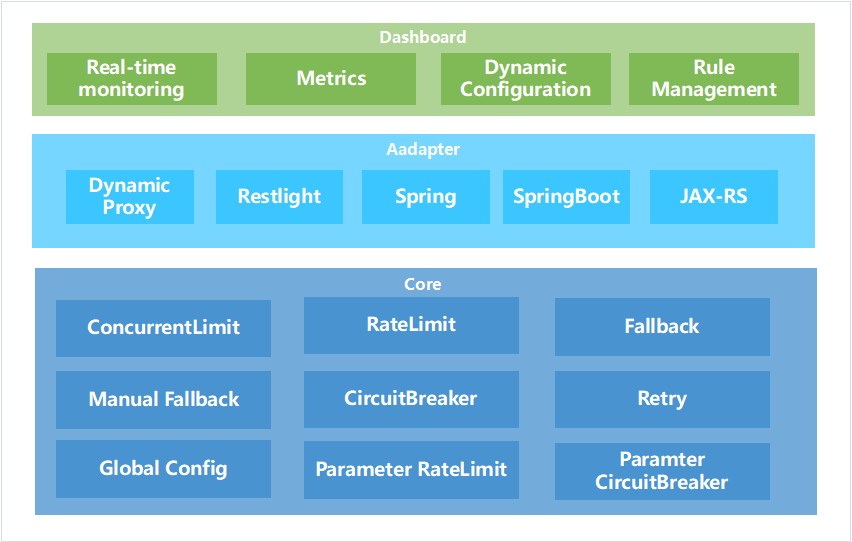

# 架构

### 概述
`ServiceKeeper`总体设计遵循简单易用的原则，整体架构也比较简洁，如下图所示：
其中：箭头所示方法表示请求正常的执行流程，特别重要地是：
1. 通常来说，只有熔断后的请求才会走降级方法，但对`ServiceKeeper`而言，并发数超过限制、流量超过限制、重试后仍然失败的请求同样会执行降级逻辑
2. 箭头所示的方向为同一个资源各个服务治理功能的执行顺序，对于同时使用参数级和方法级服务治理功能的接口，参数级的整体优先级更高，且多个参数根据参数值下标优先级依次递减。

### 执行原理
#### Spring AOP代理（适应于Spring、Spring Boot、Restlight）
对于上述应用，`ServiceKeeper`通过Spring AOP完成对原始方法的代理，并织入服务治理的功能。更具体地讲，`ServiceKeeper`会代理有指定注解的方法，包括：
- `@ConcurrentLimiter` 用于并发数限制
- `@RateLimiter` 用于流量限制
- `@CircuitBreaker` 声明熔断配置
- `@Retryable` 方法重试配置
- `@EnableServiceKeeper` 一个空注解，仅用于标识该方法可被`ServiceKeeper`代理

*只要原始方法拥有以上注解中的任何一个*，该方法就可以被`ServiceKeeper`拦截到，后续就可以通过配置文件等实时配置需要的功能。需要说明地是：
1. 除了`ServiceKeeper`内置的上述注解外，对于`Spring Boot`和`Restlight`应用而言，默认还会代理对外提供服务的`Controller`方法（即带`@RequestMapping`、`@GetMapping`、`@PostMapping`、`@PutMapping`、`@PatchMapping`、`@DeleteMapping`注解的方法），由于前述注解在两种应用中包名不同因此提供了不同的接入适配模块，详情参见[快速接入](../quick_start.md)
2. 默认情况下，`ServiceKeeper`提供的AOP的优先级最低，如果需要更改该优先级，可以参考下文自定义AOP顺序

#### Filter扩展(适用于Dubbo Extension、ESA RPC)
上述两种应用通过各自的`Filter`扩展完成Consumer和Provider接入。

#### 自定义AOP
`ServiceKeeper`支持用户代理任意指定的方法，并完成对该方法的服务治理，自定义的AOP需要继承`AbstractServiceKeeperAop`，具体示例如下：
```java
@Aspect
@Component
public class CustomizeServiceKeeperAop extends AbstractServiceKeeperAop {

    @Pointcut("execution(public * esa.servicekeeper.test.service.*.*(..))")
    private void serviceKeeper() {
    }

    @Around("esa.servicekeeper.test.CustomizeServiceKeeperAop.serviceKeeper() ")
    public Object doAround(ProceedingJoinPoint pjp) throws Throwable {
        return super.doInvoke(pjp);
    }

}
```
如上所示AOP表示，代理`esa.servicekeeper.test.service`包下的所有方法并织入服务治理的功能。使用过程中需要注意地是，`ServiceKeeper`已经完成了对带有指定注解方法的代理功能，*自定义AOP时需要避免重复代理的情况*，否则一个方法执行可能会多次执行服务治理逻辑。

#### 自定义AOP顺序
示例如下：
```java
@Bean(DEFAULT_SERVICE_KEEPER)
public DefaultServiceKeeperAop myAop() {
	return new DefaultServiceKeeperAop() {
		@Override
		public int getOrder() {
			return Integer.MAX_VALUE;
		}
	};
}
```
如上所示，更改`DefaultServiceKeeperAop`的优先级为最低。


