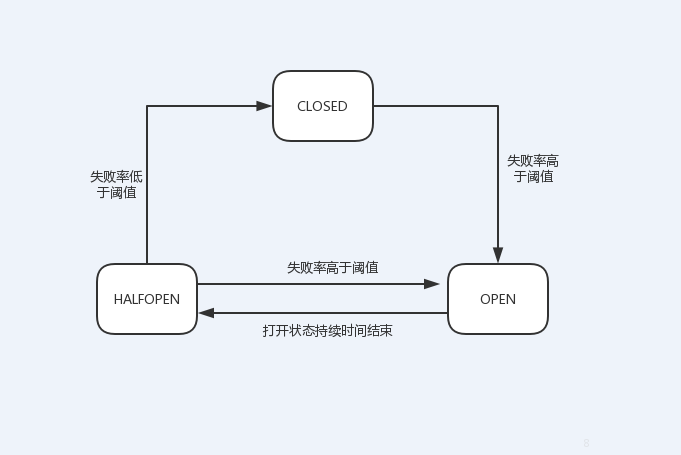

# 方法熔断
### 概述
实际生产中，方法间调用关系复杂，上游服务的异常必然导致下游请求堆积，影响整条链路的通畅，更甚者会破坏整个系统的稳定性。因此，当某个资源不可用时，及时采取“备用方案”是非常有必要的。`Service Keeper`提供了方法级的熔断降级功能，当某个方法的错误率超过阈值时，自动熔断该方法。熔断后，后续调用会执行降级方法或直接抛出`CircuitBreakerNotPermittedException`。一段时间后，`Service Keeper`允许一定量的请求去探测原方法，如果错误率低于阈值则判定原方法已经恢复，后续请求正常调用；否则继续执行降级方法。方法的熔断降级功能底层基于有限状态机来实现，`Service Keeper`开放了大量熔断器底层参数，使用时可以根据需要灵活配置。需要注意的是：

```note
1. 方法熔断的失败率阈值 `failureRateThreshold` 支持通过配置文件动态配置，实时生效。
2. 方法熔断后，如果原始方法正确配置了降级方法则直接执行降级方法，否则抛出`CircuitBreakerNotPermittedException`。
```
                                   
***熔断器三种状态的说明：***
- 关闭— 服务正常
- 打开— 服务异常，此时直接调用降级方法或抛出`CircuitBreakerNotPermittedException`
- 半开— 进入打开状态一段时间后，熔断器检查服务是否恢复



以ringBufferSizeInClosedState=100，ringBufferSizeInHalfOpenState=10，waitDurationInOpenState=60，failureRateThreshold=50为例分析熔断器的状态变化：熔断器默认为关闭状态，当最近100次请求的失败率大于或等于50%，熔断器打开，此后所有请求均被降级；60s之后熔断器自动切换到半开状态，此时允许10个请求通过，如果这10个请求的失败率低于50%，熔断器切换到关闭状态，否则熔断器再次切换到打开状态。

### 使用示例
```java
@RequestMapping("/list")
@ResponseBody
@CircuitBreaker(ringBufferSizeInClosedState = 100, ringBufferSizeInHalfOpenState = 10, predicateStrategy = PredicateByException.class, waitDurationInOpenState = "60s", failureRateThreshold = 50.0f)
public Employee list() {
    throw new RuntimeException();
}
```

默认情况下，`Service Keeper`使用异常比率作为熔断策略，即当最近100个请求的异常比率超过50%时，熔断该方法。除此之外，还提供了基于超时比率、异常+超时比率以及自定义熔断的熔断策略。

#### 1. 基于异常比率熔断
使用方式如上，此处不再赘述。
```note
可通过注解的ignoreExceptions参数配置可以忽略的异常，当方法调用抛出的异常包含在可以忽略的异常（包含子类）中时认为此次请求正常。
```

#### 2. 基于超时比率熔断
```java
@RequestMapping("/list")
@ResponseBody
@CircuitBreaker(predicateStrategy = PredicateBySpendTime.class, maxSpendTimeMs = 10)
public Employee list() {
    throw new RuntimeException();
}
```
其中，对于方法执行耗时超过10ms的调用记录为异常，否则为正常。当最近100个请求的异常比率超过50%时，熔断该方法。
```note
1. 基于超时比率熔断时必须配置 maxSpendTimeMs
2. maxSpendTimeMs支持动态配置，实时生效
```

#### 3. 异常+超时比率
```java
@RequestMapping("/list")
@ResponseBody
@CircuitBreaker(predicateStrategy = PredicateByExceptionAndSpendTime.class, maxSpendTimeMs = 10)
public Employee list() {
    throw new RuntimeException();
}
```
其中，对于方法执行耗时超过10ms**或**调用过程中抛出异常的调用记录为异常，否则为正常。当最近100个请求的异常比率超过50%时，熔断该方法。
```note
1. 基于超时比率熔断时必须配置 maxSpendTimeMs
2. maxSpendTimeMs支持动态配置，实时生效
```

#### 4. 自定义熔断策略
```java
@RequestMapping("/list")
@ResponseBody
@CircuitBreaker(predicateStrategy = CustomizePredicateStrategy.class)
public Employee list() {
    throw new RuntimeException();
}
```

其中，CustomizePredicateStrategy为自定义熔断策略，该类需要实现PredicateStrategy接口，具体如下：
```java
@Component
public class CustomizePredicateStrategy implements PredicateStrategy {

    @Override
    public boolean isSuccess(Context ctx) {
        if (ctx.getResult().equals("200")) {
            return true;
        } else {
            return false;
        }
    }

}
```

如上，自定义熔断策略为：通过当前调用的上下文获取调用结果，如果为200则记录为正常，否则为异常。当最近100个请求的异常比率超过50%时，熔断该方法。
```note
1. 自定义的熔断策略必须注入Spring容器或提供无参的构造方法。
2. 通过请求上下文可获取的信息包含：调用时的实际参数、方法执行耗时、业务异常等。
3. 如果配置文件中存在方法熔断的同名配置则配置文件中的参数优先级更高。
```

#### 5. 更多`@CircuitBreaker`注解的属性说明：

| 属性名称         |      类型    |             描述          |       默认值    |      备注      |     是否支持动态配置                                            
| --------------- |   :--------  | :----------------------- | -------------- |  ---------- | ------
|  ringBufferSizeInClosedState     |  int                       |  熔断器关闭状态下ring buffer大小  |       100                |        |   否
|  ringBufferSizeInHalfOpenState    |  int                       |  熔断器半开状态下ring buffer大小 |       10             |       |   否
|  waitDurationInOpenState         |  String                       |  熔断器从打开到半开等待时长       |       60s          |       |   否
|  failureRateThreshold           |  float                     |  失败率阈值                   |       50.0            |         |  **是**
|  ignoreExceptions              |  Class<? extends Throwable>[]   |   不纳入失败总数的异常类型       |       Class[]{}            |                |   否   |
|  predicateStrategy              |  Class<? extends PredicateStrategy>   |   熔断策略       |       PredicateByException.class            |                |   否   |
|  maxSpendTimeMs              |  int   |   方法最大耗时       |       -1           |    使用根据平均耗时熔断时的必需配置            |    **是**   |

### 注解配置简化
```java
@RequestMapping("/list")
@ResponseBody
@CircuitBreaker(50.0f) //表示 failureRateThreshold 为50.0f，其他配置为默认值
public Employee list() {
    throw new RuntimeException();
}
```

### 配置文件配置
如前文所述，如果需要熔断的方法可以被`Service Keeper`拦截到，可以不使用`@CircuitBreaker`进行配置，通过在配置文件中配置相应也可完成对原始方法的熔断配置。
示例如下：
```properties
#方法熔断的失败率阈值百分比，默认为50.0f
io.esastack.servicekeeper.TestController.failureRateThreshold=80.0f

#熔断器关闭状态下ringBuffer大小，默认为100
io.esastack.servicekeeper.TestController.list.ringBufferSizeInClosedState=2

#熔断器半开状态下ringBuffer大小，默认为10
io.esastack.servicekeeper.TestController.list.ringBufferSizeInHalfOpenState=2

#熔断器从打开切换到半开状态的等待时间，默认为60s[单位为：毫秒(ms)、秒(m)、分钟(min)]
io.esastack.servicekeeper.TestController.list.waitDurationInOpenState=59s

#忽略异常（抛出此类异常及其子类异常时仍认定原始方法执行正确）
io.esastack.servicekeeper.TestController.list.ignoreExceptions=[java.lang.RuntimeException, java.lang.IllegalArgumentException]

#方法最大耗时
io.esastack.servicekeeper.TestController.list.maxSpendTimeMs=100

#判定方法是否执行成功的策略
io.esastack.servicekeeper.TestController.list.predicateStrategy=\
  io.esastack.servicekeeper.core.moats.circuitbreaker.predicate.PredicateByExceptionAndSpendTime
```

其中，`io.esastack.servicekeeper.TestController.list`为原始方法的名称（类全限定名+方法名）。
```note
通过配置文件配置方法熔断阈值 `failureRateThreshold`为必需配置，其余参数如不配置将使用默认值。
```
